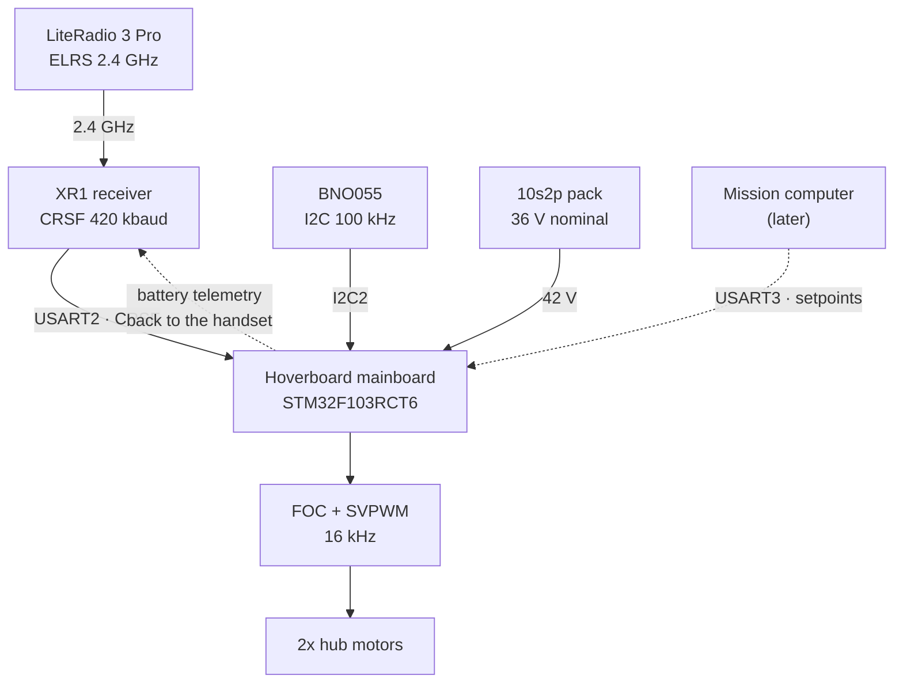
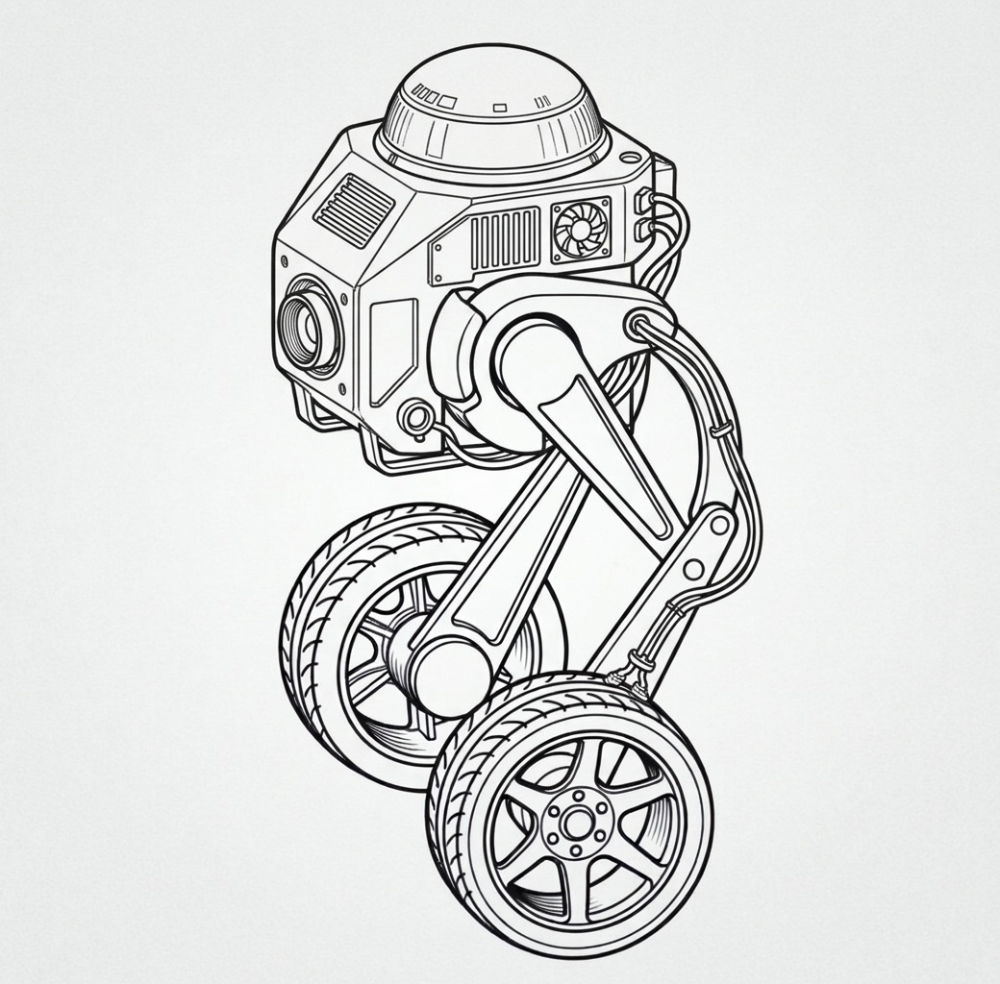

<div align="center">

# JBOT-Wheeled Biped

**A self-balancing wheeled robot built on a donor hoverboard, in Rust.**

Two stages: a two-wheel balancing platform first, then two hip actuators that let
the legs move the body independently.

[](https://www.rust-lang.org/)
[](docs/hardware.md)
[](docs/roadmap.md)
[](docs/)
[](docs/skills/rust_robotics_guidelines.md)

</div>

---

## Overview

**JBOT-Wheeled Biped** is a research-grade balancing robot. The wheeled platform
comes from a stock hoverboard: its mainboard, hub motors, battery, power button,
and charge port are reused as-is. The balancing controller is written from
scratch and runs on the mainboard itself, so the robot keeps standing even when
the radio link or the mission computer is lost.

The project is delivered in two stages.

| Stage | Hardware | Behaviour |
|---|---|---|
| **1. Two wheels** | Donor hoverboard mainboard, 2 hub motors, 10s battery, BNO055, XR1 receiver | Balance, drive forward and backward, turn, spin in place, variable speed, commanded from the radio |
| **2. Two hips** | Stage 1 plus two hip actuators and their drivers | The legs move the body independently: height, pitch offset, and roll via differential hip angle |

Stage 2 keeps the same wheel controller, the same radio link, and the same
balancing core. The long-term goal is a wheeled biped that stands and drives
itself and later accepts a mission computer for autonomous navigation.

---

## Hardware used from the hoverboard

| Donor part | Specification | Role |
|---|---|---|
| Mainboard | STM32F103RCT6, Cortex-M3 at 72 MHz, 256 KB flash, 48 KB RAM, 12 MOSFETs in two 3-phase bridges | Motor control, FOC, balancing, power latch, telemetry |
| Hub motors | 2× direct-drive brushless, about 350 W each, 15 hall states, 6.5 in wheels (radius 0.0825 m) | Drive and speed feedback |
| Battery | 10s2p Li-ion, 36 V nominal, 42.0 V full, about 30 V cutoff, 4.4 A·h, ~158 W·h, integrated BMS | Energy |
| Power button | Soft latch held by the firmware (PA5) | Power on/off |
| Charge port | BMS charge input with a charge-detect line (PA12) | Charging and charge interlock |

Discarded: both sideboards (their own MCU, MPU6050-class IMU, battery LEDs, and
footpad sensors), the deck, and the plastic covers. The sideboards are UART
slaves that transmit on the same wires the radio and the IMU need.

Added to the robot:

| Part | Selection | Role |
|---|---|---|
| Radio transmitter | **BetaFPV LiteRadio 3 Pro, ExpressLRS 2.4 GHz**, 8 channels | Operator command: arm, throttle, steering |
| Radio receiver | **RadioMaster XR1, ExpressLRS 2.4 GHz**, CRSF output, 420 kbaud | Converts the radio link into a serial stream for the mainboard |
| IMU | **Bosch BNO055**, 9-DOF with onboard fusion, I2C | Tilt and tilt rate for the balance loop |
| DC-DC | 36–42 V to 5 V, input rated for at least 60 V | Receiver and IMU supply |
| Protection | Main fuse and a hardware kill switch in the battery line | Real emergency stop |
| Stage 2 only | 2× hip actuators, model TBD, with drivers | Independent leg motion |

The receiver must be bound to the transmitter and both must run the same
ExpressLRS major version. The radio link is a command input, never a safety path.

---

## Control architecture


```mermaid
flowchart TB
    TX["LiteRadio 3 Pro<br/>ELRS 2.4 GHz"]
    RX["XR1 receiver<br/>CRSF 420 kbaud"]
    IMU["BNO055<br/>I2C 100 kHz"]
    MCU["Hoverboard mainboard<br/>STM32F103RCT6"]
    FOC["FOC + SVPWM<br/>16 kHz"]
    MOT["2x hub motors"]
    BAT["10s2p pack<br/>36 V nominal"]
    PC["Mission computer<br/>(later)"]

    TX -->|"2.4 GHz"| RX
    RX -->|"USART2 · CRSF"| MCU
    IMU -->|"I2C2"| MCU
    BAT -->|"42 V"| MCU
    MCU --> FOC --> MOT
    PC -.->|"USART3 · setpoints"| MCU
    MCU -.->|"battery telemetry<br/>back to the handset"| RX
```

| Loop | Where | Rate |
|---|---|---|
| FOC current and SVPWM | Mainboard timer ISR | 16 kHz |
| Balance (pitch PD, speed, yaw) | Mainboard main loop | 200 Hz |
| Attitude | BNO055 fusion | 100 Hz |
| Radio setpoints | CRSF over USART2 | up to 250 Hz |
| Mission computer setpoints | USART3 frame | 50–100 Hz, optional |

The balance loop depends on neither external link. Losing the radio or the
mission computer means standing still, not falling. Only the radio can arm.

Full details, pin maps, and the two-stage plan are in
[`docs/hardware.md`](docs/hardware.md) and
[`docs/architecture.md`](docs/architecture.md).

---

## Mechanical concept (stage 2)

Stage 1 is a plain two-wheel balancer: one hub motor per wheel, battery and
electronics low and centred between the wheels.

Stage 2 adds one hip actuator per leg. Each leg is a planar **1-DOF four-bar
linkage** — not a 2-DOF five-bar and not a serial two-link leg. The "knee" is a
rigid bend of the wheel fork, not an articulated joint. The **base is the
chassis link A–B**; the wheel is a single ground contact at **E**.

| Element | Type | Motor / function |
|---|---|---|
| A–B | Ground link | Base / chassis, fixed to the body |
| A | Revolute joint | Hip actuator, driven |
| B | Revolute pivot | Passive rocker |
| A–C | Upper crank | Driven by the hip actuator |
| B–D | Lower rocker | Passive |
| C–D–E | Wheel fork | One rigid coupler; E is the wheel axle |
| E | Wheel axle | Hub motor, driven |
| Spring / damper | Optional passive element | Between the base and the upper crank |

One hip angle moves the wheel along a fixed coupler curve; body height and
fore-aft offset are coupled and cannot be commanded independently. That is the
accepted trade for a stiff, simple, lightweight leg.

<p align="center">
  
</p>

> Concept sketch, not a dimensioned drawing. Link lengths and the actuator
> envelope come out of CAD after the stage 1 balance is proven.

---

## Key properties

- **Local balance loop** — the robot stands without the radio and without the
  mission computer. Loss of either link zeroes the setpoints, it does not cut
  motor torque.
- **One commanding authority at a time** — the radio takes over as soon as a
  stick moves; the mission computer commands only inside a validity window.
- **Donor power stage** — the original MOSFET bridges, current shunts, hall
  inputs, and battery BMS are reused, with conservative limits until thermal
  behaviour is measured.
- **Staged risk** — the stock firmware is flashed first as a link and flashing
  test; the custom controller replaces it only after the hardware is proven.
- **Rust workspace with one-way dependencies** — shared types stay I/O-free;
  hardware, navigation, and the node compose them.

---

## Workspace layout

```text
jbot/
├── Cargo.toml                  # Host workspace definition and release profile
├── config/
│   └── robot.toml              # Typed robot configuration
├── crates/
│   ├── jbot_common/            # Shared messages, state types, configuration
│   ├── jbot_hardware/          # HAL: transports, sensors, actuators
│   ├── jbot_navigation/        # Costmaps, planners, navigation stack
│   └── jbot_node/              # High-level executable for the mission computer
├── firmware/
│   ├── README.md               # Hoverboard bring-up, flashing, I/O map, Rust plan
│   ├── eferu-jbot.patch        # Config delta applied to the stock firmware
│   └── eferu/                  # Upstream firmware clone (git-ignored)
└── docs/
    ├── specification.md        # System Requirements Specification (SRS-001)
    ├── architecture.md         # System architecture and safety concept
    ├── hardware.md             # Donor hardware, radio, IMU, interfaces
    ├── bom.md                  # Component and assembly list
    ├── roadmap.md              # Phased delivery plan and gate criteria
    ├── system_requirements.md  # High-level requirements
    ├── agent_workflow.md       # Engineering workflow
    ├── tasks.md                # Task breakdown
    └── skills/                 # Rust robotics engineering guidelines
```

> **Dependency rule:** `jbot_common` stays free of I/O. Hardware and navigation
> crates may depend on it; the node wires the pieces together. The hoverboard
> firmware in `firmware/` is a separate embedded project and is not part of the
> host workspace.

---

## Quick start

### Prerequisites

- [Rust toolchain](https://rustup.rs/) 1.75+ (edition 2021)
- A C linker (`cc` / `clang`) for the host build
- For the hoverboard: `pipx install platformio`, plus an ST-Link probe and a
  3.3 V USB-UART adapter

### Build and test

```bash
git clone git@github.com:fobaty/jbot.git
cd jbot

cargo build --workspace
cargo run -p jbot_node
cargo test --workspace
```

### Hoverboard firmware

```bash
cd firmware/eferu
pio run -e VARIANT_PWM              # build
pio run -e VARIANT_PWM -t upload    # flash, board powered from its battery
```

Wiring, recovery from a read-protected chip, and the bench checklist are in
[`firmware/README.md`](firmware/README.md).

### Quality gates

Run before every merge:

```bash
cargo fmt --all -- --check
cargo check --workspace --all-targets
cargo test --workspace
cargo clippy --workspace --all-targets -- -D warnings
```

### Release build

```bash
cargo build --release -p jbot_node
```

The release profile enables LTO, a single codegen unit, and `panic = "abort"`
for predictable footprint and latency.

---

## Roadmap

| Stage | Focus | Gate |
|:-----:|-------|:----:|
| **1** | Hoverboard mainboard, hub motors, battery, XR1 + LiteRadio, BNO055, two-wheel balancing | G1 |
| **2** | Two hip actuators and drivers, leg mechanism, independent body motion | G2 |
| **3** | Mission computer, telemetry, state estimation, HIL | G3 |
| **4** | SLAM, localization, navigation, autonomous runs | G4 |
| **5** | Camera/AI, manipulator, autonomous docking | G5 |

Detailed tasks, gate criteria, and the critical path live in
[`docs/roadmap.md`](docs/roadmap.md).

---

## Safety

This robot stores enough energy to injure people and damage property. The
hoverboard power stage has no hardware emergency stop and the power button is
only a firmware-held soft latch, so the safety concept is layered:

1. **Hardware plane** — fuse and a kill switch in the battery line. This is the
   only path that works when the firmware hangs.
2. **Real-time plane** — tilt cutoff, current limits, watchdog, and charge
   interlock enforced on the mainboard within one balance period.
3. **Supervisor plane** — battery, temperature, latency, and fault monitoring on
   the mission computer, once it exists.

> Never disable a safety layer for convenience. Changes to firmware, transport,
> or control loops require a review against
> [`docs/skills/rust_robotics_guidelines.md`](docs/skills/rust_robotics_guidelines.md).

Two donor-specific hazards matter from day one:

- **Regenerative braking.** Leaning back charges the pack. A full pack can trip
  the BMS on overvoltage and spike the DC link; start runs at about 90 % charge.
- **Charge interlock.** The charge-detect line must inhibit arming and motor
  output while the charger is plugged in.

---

## Documentation

| Document | Contents |
|---|---|
| [`docs/specification.md`](docs/specification.md) | Requirements, priorities (P1/P2/P3), traceability |
| [`docs/architecture.md`](docs/architecture.md) | Compute tiers, interfaces, power, safety concept |
| [`docs/hardware.md`](docs/hardware.md) | Donor hardware, radio link, IMU, interfaces |
| [`docs/bom.md`](docs/bom.md) | Complete component and assembly list |
| [`docs/system_requirements.md`](docs/system_requirements.md) | Hardware and software requirements |
| [`docs/roadmap.md`](docs/roadmap.md) | Phases, gates, schedule, critical path |
| [`docs/tasks.md`](docs/tasks.md) | Granular task breakdown |
| [`docs/agent_workflow.md`](docs/agent_workflow.md) | Contribution and review workflow |
| [`firmware/README.md`](firmware/README.md) | Hoverboard build, flash, wiring, Rust plan |

---

## Contributing

1. Branch from `main` using a prefixed name: `feature/`, `fix/`, `refactor/`,
   `hotfix/`, or `chore/`.
2. Keep changes scoped and covered by tests.
3. Run the full quality gate suite above.
4. Write all code comments, commit messages, and documentation in **English**.
5. Open a pull request with context, test evidence, and safety impact.

---

## License

Released under the [MIT License](LICENSE). © 2026 Oleksii Shataliuk.

---

## Status

Stage 1 is in bench bring-up. The stock firmware builds and is ready to flash;
the custom Rust controller follows once the hardware chain is verified. Expect
the API and the pin map to move until the G1 gate is passed.

---

<div align="center">
<sub>JBOT-Wheeled Biped · SRS-001 · Architecture v0.3 · Roadmap RB-001</sub>
</div>
